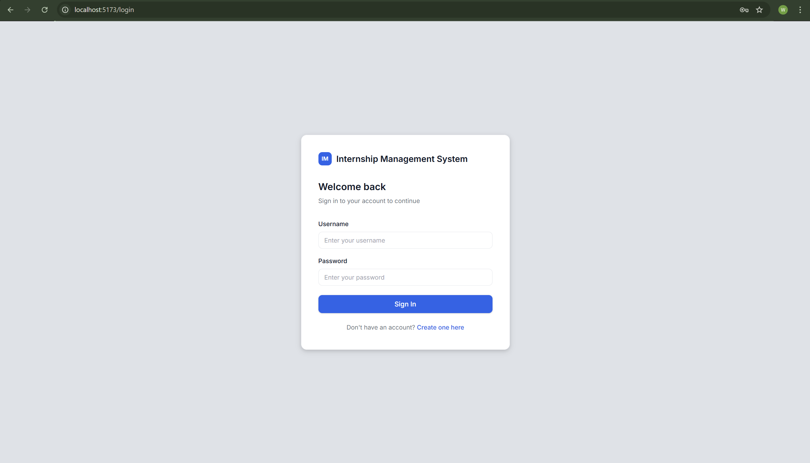
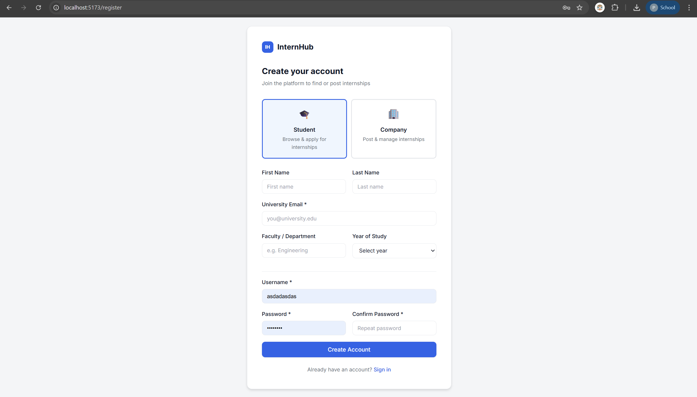
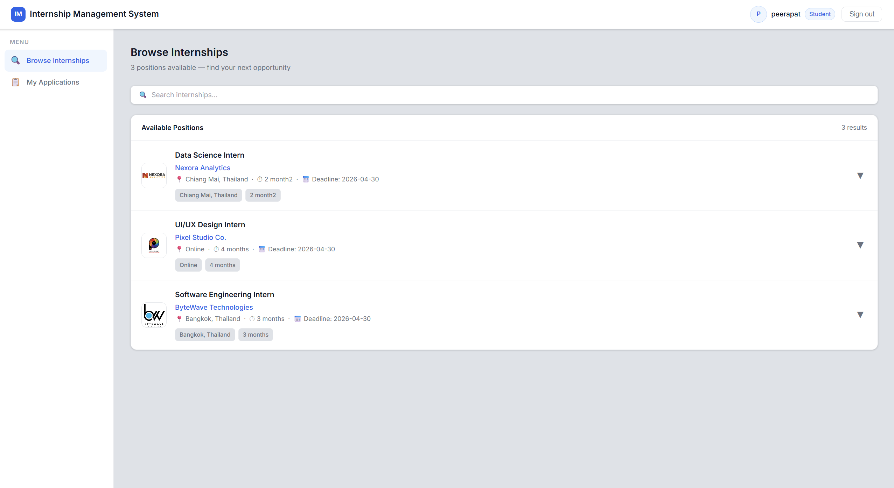
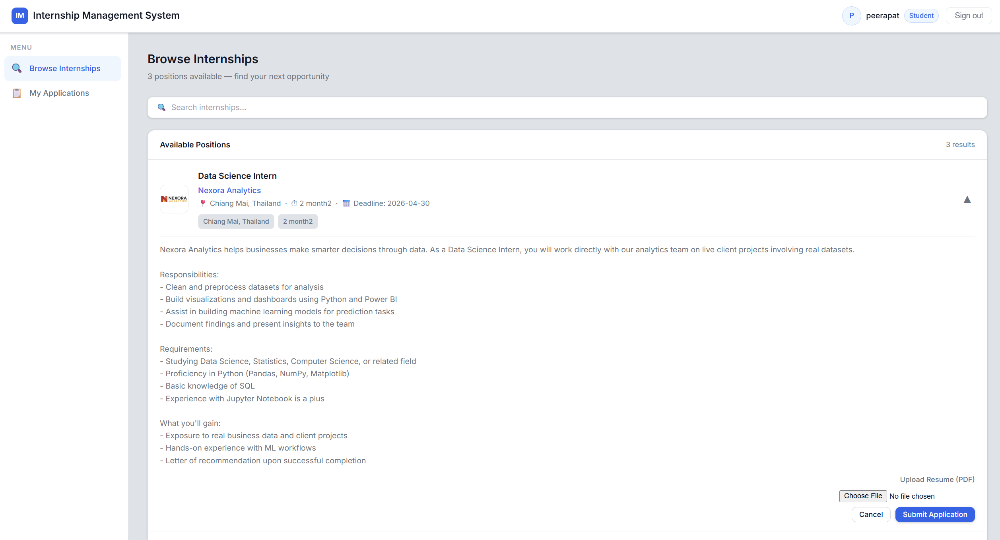
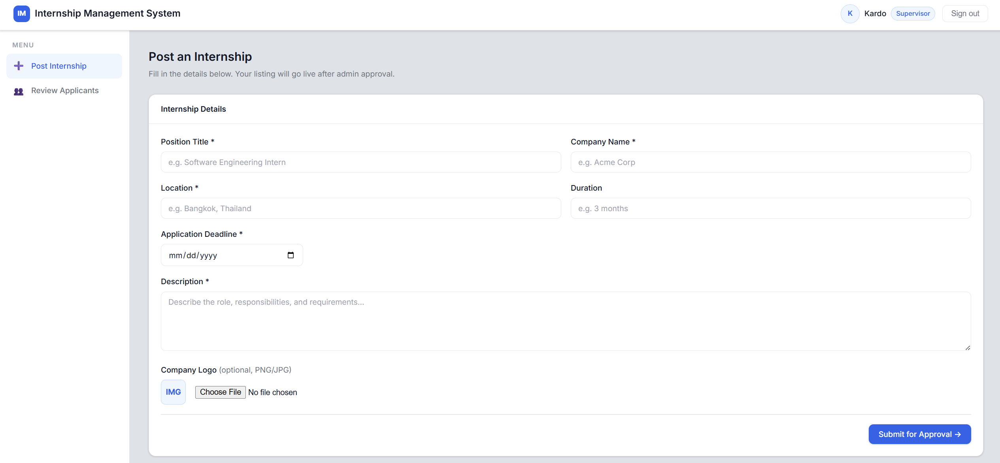
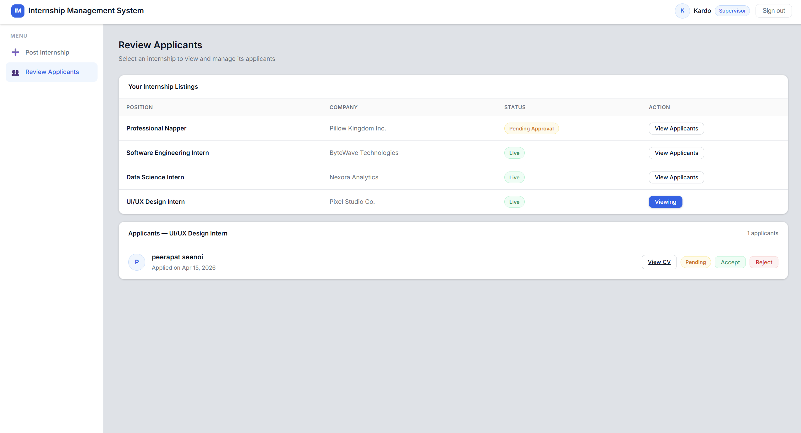
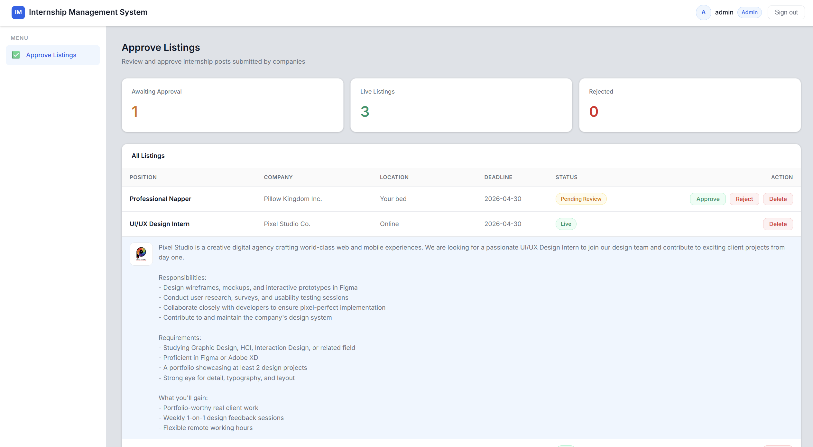

# Internship Management System

A web-based platform that centralizes the internship process for university students — from browsing and applying for positions to supervisor review and admin approval.

---

## Project Description

Traditional internship management relies on emails and paper forms, leading to lost documents, missed applications, and no visibility on status. The Internship Management System replaces this with a structured platform where:

- **Students** browse approved internship listings and apply with their resume
- **Supervisors** post internship positions, upload a company logo, and review applicants
- **Admins** approve or reject listings before they go live to students

The system enforces a clear workflow:

```
Supervisor posts listing
        ↓
Admin approves or rejects
        ↓
Students browse and apply
        ↓
Supervisor accepts or rejects applicants
        ↓
Accepted students receive supervisor contact email
```

---

## System Architecture Overview

The system uses a **Layered Architecture (N-Tier)** with 4 distinct layers, each with a single responsibility:

```
┌──────────────────────────────────────────────┐
│  Presentation Layer   →   React.js (Vite)    │
│  Pages, components, API client               │
├──────────────────────────────────────────────┤
│  API Layer            →   Django REST        │
│  Views, serializers, permission classes      │
├──────────────────────────────────────────────┤
│  Business Logic Layer →   services.py        │
│  All rules, validations, workflows           │
├──────────────────────────────────────────────┤
│  Data Layer           →   PostgreSQL         │
│  Models, constraints via Django ORM          │
└──────────────────────────────────────────────┘
```

| Layer | Responsibility |
|-------|---------------|
| **Presentation** | Display data and capture user input only. No business logic. |
| **API** | Translate HTTP requests into operations. Delegate all logic to services. |
| **Business Logic** | All rules live here — duplicate checks, role filtering, status validation. |
| **Data** | Define data structure and database constraints only. |

---

## User Roles & Permissions

| Role | How Created | Permissions |
|------|-------------|-------------|
| **Student** | Self-register | Browse approved internships, apply with resume, track application status, withdraw pending applications |
| **Supervisor** | Self-register as Supervisor | Post internship listings, upload company logo, delete own listings, review applicants, accept or reject applicants |
| **Admin** | Django admin panel only | View all listings, approve or reject pending listings, delete any listing |

> Admin accounts cannot be created through the registration page. They must be created via the Django admin panel and assigned the `admin` role manually.

### Privacy Rule
The supervisor's contact email is hidden by default. It is only revealed to a student once their application has been **accepted**.

---

## Technology Stack

| Layer | Technology |
|-------|-----------|
| Frontend | React.js (Vite) |
| Backend | Django 5.2, Django REST Framework |
| Authentication | JWT via djangorestframework-simplejwt |
| Database | PostgreSQL |
| HTTP Client | Axios |
| Routing | React Router DOM v6 |
| Image Processing | Pillow |

---

## Installation & Setup

### Prerequisites
- Python 3.11+
- Node.js 18+
- PostgreSQL 15+

### 1. Clone the repository
```bash
git clone https://github.com/Bezzilla/Internship-Management.git
cd Internship-Management
```

### 2. Set up the backend
```bash
# Create and activate virtual environment
python -m venv venv
venv\Scripts\activate        # Windows
source venv/bin/activate     # Mac/Linux

# Install dependencies
cd backend
pip install -r requirements.txt
```

### 3. Configure environment variables
```bash
cp .env.example .env
```
Open `.env` and fill in your PostgreSQL credentials and a secret key:
```
SECRET_KEY=your-secret-key-here
DB_NAME=internship_db
DB_USER=postgres
DB_PASSWORD=your-password
DB_HOST=localhost
DB_PORT=5432
```

### 4. Set up the database
```bash
# Create the database in PostgreSQL
psql -U postgres
CREATE DATABASE internship_db;
\q

# Run migrations
python manage.py makemigrations
python manage.py migrate

# Create an admin account
python manage.py createsuperuser
```

### 5. Set up the frontend
```bash
cd ../frontend
npm install
```

---

## How to Run the System

### Start the backend
```bash
cd backend
venv\Scripts\activate        # Windows
source venv/bin/activate     # Mac/Linux
python manage.py runserver
```
Backend runs at: **http://localhost:8000**

### Start the frontend
Open a second terminal:
```bash
cd frontend
npm run dev
```
Frontend runs at: **http://localhost:5173**

### Set admin role
1. Go to **http://localhost:8000/admin**
2. Log in with your superuser credentials
3. Click **Users** → select your user
4. Set **Role** to `admin` → Save

---

## Screenshots

### Login Page


### Register Page


### Student — Browse Internships


### Student — My Applications


### Supervisor — Post Internship


### Supervisor — Review Applicants


### Admin — Approve Listings

